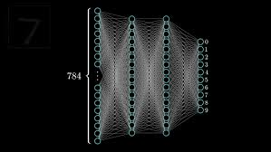
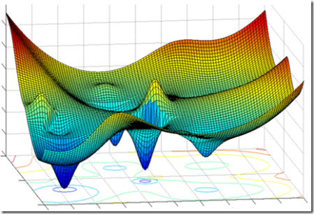
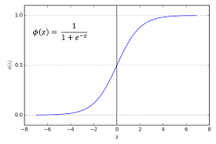

# handwritten-digit-classifier
> Deep Learning project using MNIST dataset
> With this network max 88.6 +/- 0.2 was observed
---

## Neural Network Structure

---
## Gradient descent to find global minima

---
### Sigmoid function
> Reduce any real number value in between 0 to 1.0

---

# Introduction
Goal is to classify hand written digits. I've used **[784-16-16-10]** layer structure.
One can play around with the net structure, keeping first and last layer fixed. 

# STRUCTURE
* **Dataset:** 
	* Get training and test dataset from MNIST dataset.
	* Each data is a **(784x1)** vector
	* Each label is a **(10x1)** vector
	* A total of 60000 training and 20000 test dataset
	* Mini batch size is 16 **i.e.** each mini_batch contains 16 train dataset

* **Network:**
	* Initialize random weights and biases for all layers
	* **For each epoch**
		* **For each mini batch**
			* **For each data and label in mini batch**
				* Activations calculation
				* Loss calculation
				* Delta values calculation with **Gradient descent** method
				* Nabla values calculation
				* Update weights and biases with learning rate **0.1**
			* Evaluate network's accuracy for the test dataset

> **NB:** Output layer consists total 10 neurons. Activation of each neuron denotes the corresponding digit.
---

## Activation calculation
```python
z = np.dot(w, a)+b
a = self.sigmoid(z)
```
## Loss calculation
```python
loss = np.sum(np.power(np.subtract(self.a[-1],y),2))/(2.0*self.dataset.mini_batch_size)
```
### Cost derivative
```python
cost_derivative = np.subtract(self.a[-1], y)
```
### Derivative of activation
```python
def sigmoid_derivative(a):
	return a*(1-a)


activation_derivative = sigmoid_derivative(activation)
```

### Delta and nabla calculations
**For output layer**
```python
delta = cost_derivative*self.sigmoid_derivative(self.a[-1])
self.nabla_w[-1] = np.dot(delta, self.a[-2].T)
self.nabla_b[-1] = delta
```
**For hidden layers:** codes for the previous layer of output
```python
# For previous layer of the output-layer, L.
# delta in the right hand of the first eqn. is the output layer's delta
delta = np.dot(self.weights[L].transpose(), delta) * self.sigmoid_derivative(self.a[L-1])
self.nabla_b[L-1] = delta
self.nabla_w[L-1] = np.dot(delta, self.a[L-2].transpose())
```

```python
weight = weight + (-learning_rate*mini_batch_size)*nabla_w
bias = bias + (-learning_rate*mini_batch_size)*nabla_b
```


## Execute the codes
**Install dependencies**
```bash
pip3 install -r requirements.txt
```
**Codes were written on Python v3.6.6**


**Run Network.py**
```bash
python3 Network.py
```